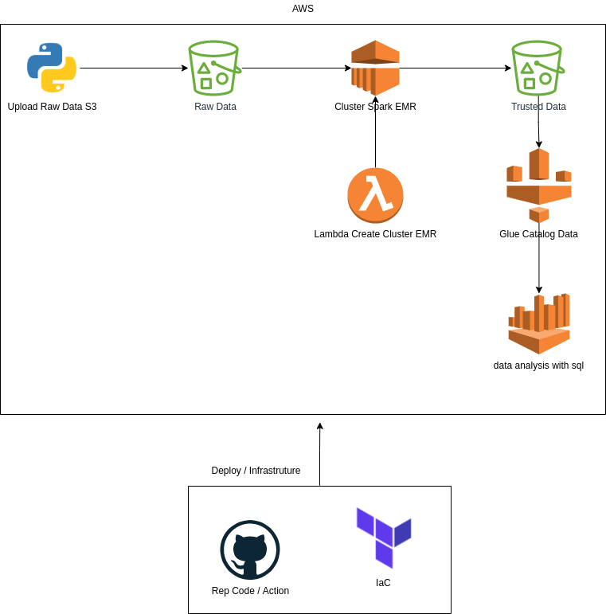

# Processamento Batch com dados do Censo Escolar 2020 

Implementação de um processamento batch usando a cloud AWS, infraestrutura como código com Terraform e esteira de deploy com GitHub Actions

O Objetivo dessa arquitetura é processar os dados do censo escolar 2020 disponivel em: <https://www.gov.br/inep/pt-br/acesso-a-informacao/dados-abertos/microdados/censo-escolar>
, fazer o upload num bucket s3 na camada de raw data, processar o dado da raw com Spark usando um cluster EMR e disponibilizar o dado na camada de trusted data, mapear os dados da trusted usando Glue e por fim, utilizar o Athena para realizar query sql nos dados.

Abaixo segue o desenho da arquitetura.

